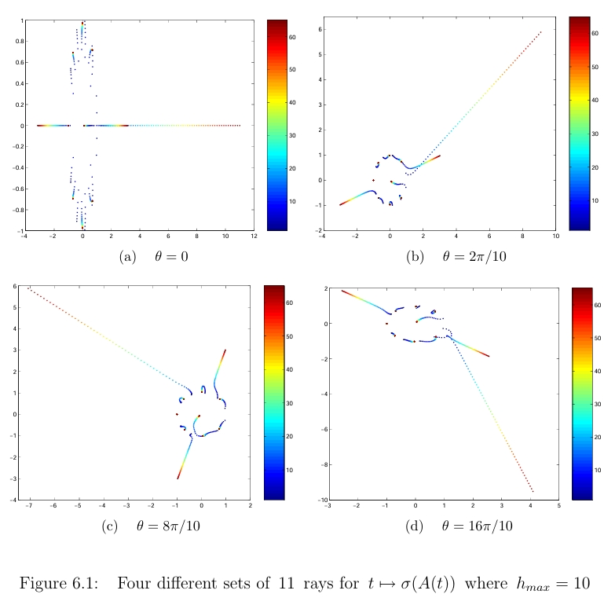
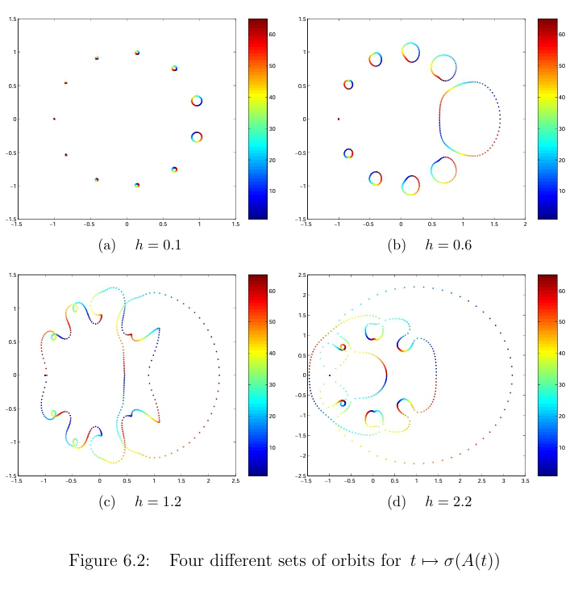
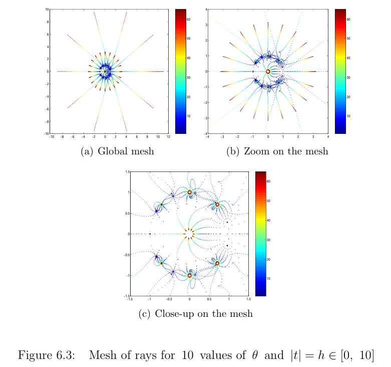
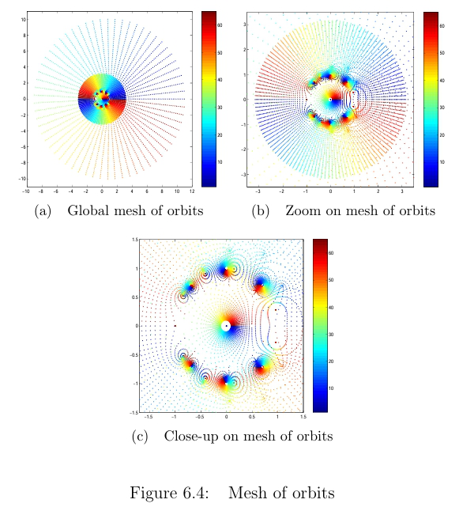
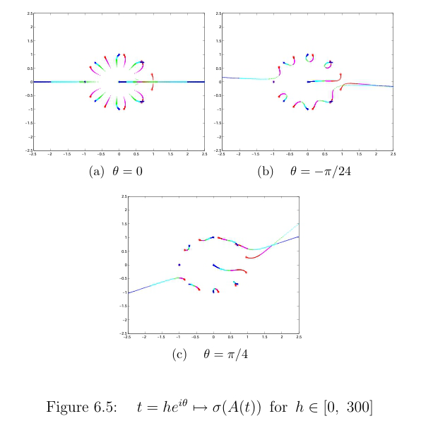
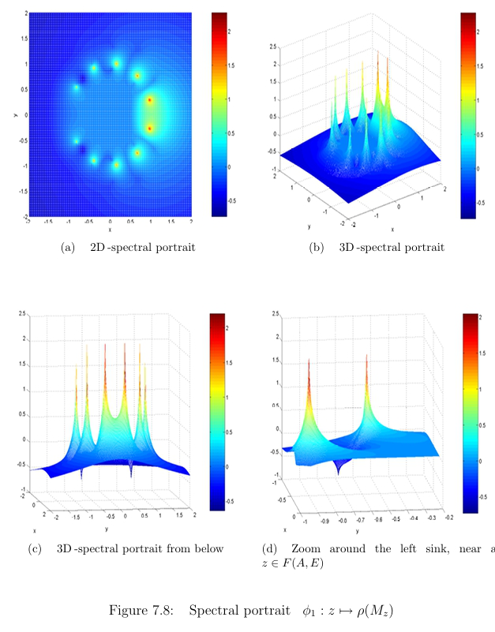
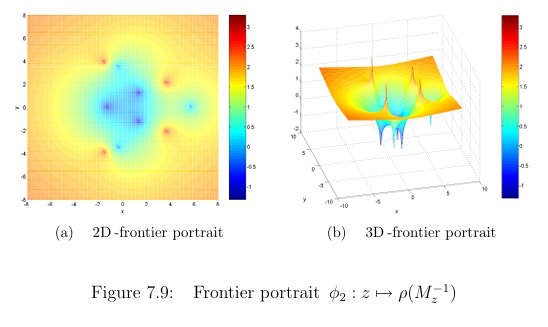

# Homotopic-Deviation-Theory-for-Matrices
A framework for studying spectral properties of matrix couplings, introducing new singularities, backward analysis, and visualization tools that reveal stability and structural behaviors.

# Homotopic Deviation theory: A qualitative study

This repository presents results from a long research projrct, which developed a comprehensive **Homotopic Deviation (HD) theory** as a very useful extension of matrix linear perturbations of the form:

\[
A(t) = A + tE,
\]

where \(E\) is a singular deviation matrix and \(t\) is a complex parameter.

---

## 🎯 Aims
- Establish a general framework for **Homotopic Deviation theory** in matrix analysis.
- Extend classical perturbation theory by identifying new **algebraic singularities** (frontier and critical points).
- Provide a **homotopic backward analysis**, complementing traditional normwise error analysis.
- Design **visualization techniques** (spectral orbits, meshes, homotopic portraits) to study eigenvalue dynamics.

---

## ✨ Theoretical and Qualitative Achievements
- First complete account of HD theory, with rigorous definitions of **homotopic spectra** and their singular structures.  
- Introduction of **frontier** and **critical points** as new algebraic singularities in matrix perturbations.  
- Development of **homotopic backward error measures**, enhancing stability analysis in finite precision computations.  
- Creation of **visualization tools** that provide qualitative insight into spectral and resolvent behavior, including **homotopic portraits** and **meshes**.  
- Application of HD ideas to **Arnoldi’s method**, showing potential for improved eigenvalue solvers.  

---

## 📊 Perspectives
The theory opens several directions for further exploration:
- Application of HD-based analysis to large-scale numerical linear algebra.  
- Extension of HD concepts to other iterative methods and nonlinear eigenvalue problems.  
- Use of **visual homotopic portraits** as diagnostic tools in numerical stability studies.
- Apply HD to practical engineering problems, including examples from acoustics and civil engineering.

---

## 📊 Figures

  

  

  

  

  

  

  

---

## 📄 Reference
If you use or refer to this work, please cite: Morad Ahmadnasab, Homotopic deviation theory: a qualitative study [PhD thesis]. Universite
Toulouse I and CERFACS, TH/PA/07/120,  Toulouse, France. 
 https://cerfacs.fr/wp-content/uploads/2016/02/TH_PA_07_120_AHMADNASAB-1.pdf
